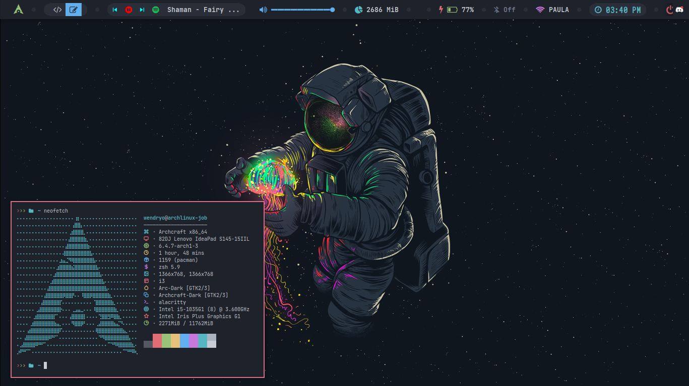

## Dependencies

Here are the dependencies required to use my dotfiles configurations:

- [spotify_player](https://github.com/aome510/spotify-player): Command-line tool to control Spotify.

Note: If possible, it's recommended to install spotify_player with cargo to take advantage of its daemon feature, which allows you to control Spotify playback as a background process. This feature can be beneficial for seamless integration with various scripts and applications.

## Prints

